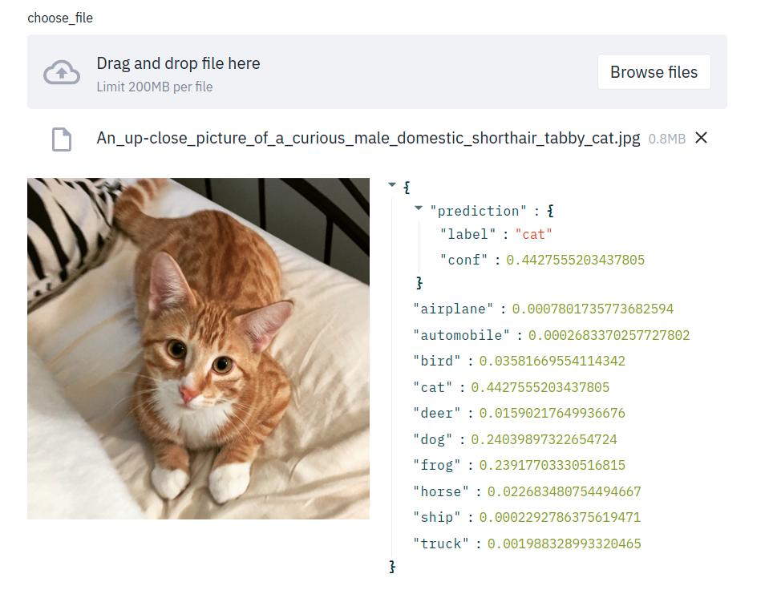

# Multi Class Image Classifier



A Small multi class classifier based on CNN, the classifier support images with different input channels (1, 3).

## Installation

You need to clone the repo and create a **`python3.7`** virtualenv as follows.

```bash
$git clone https://github.com/AliAbdelaal/simple-image-classifier.git
$cd simple-image-classifier/
$python -m venv venv
$source venv/bin/activate
$pip install .
```

## Usage

### Prepare the data

To train a new classifier on a custom dataset, you need to wrap it in a `torch.utils.data.Dataset` object, the data should be of type `FloatTensor()`.

### Train the model

Once the data is ready you can instantiate a `Brain` object and use the `fit` function to train it as follows.

```python
from classifier import Brain
brain = Brain(epochs=5)

# prepare your data
dataset = ...

# train your model and specify the number of input channels in the dataset
brain.fit(train_set, number_of_channels)
```

### Exporting and loading your model

Once the model is trained you can export it and load it for later usage, the model is exported in two files.

- `clf.pt` : the model state dictionary.
- `configs.json` : the configs of the model.

you can save or load the model via the API as follow

```python
from classifier import Brain
brain = Brain(epochs=5)

# train your classifier ...

# export the model
brain.export_model(model_path)

# load the model
brain.load_model(model_path)
```

### make predictions

The `Brain` class supports multiple ways of prediction

- `Brain.predict_image(image_bytes)` :

  This function accept an Image data of type `bytes`, prepare it and get the predictions as a dictionary.

- `Brain.predict_batch(data)` :

  This function accept a batch of tensors that represents images, the batch is expected to be of shape (n, C, W, H), and it outputs a list of labels for each input tensor.

- `Brain.predict_tensor(data)` :

  The function accept an image tensor, that could be of shape (W, H) or (C, W, H). The function outputs the predictions as a dictionary.

The prediction dictionary is as follows for a classifier that is trained on `CIFAR10` dataset.

```json
{
  "prediction": {
    "label": "dog",
    "conf": 0.6868124604225159
  },
  "airplane": 0.0003579219337552786,
  "automobile": 0.00016830475942697376,
  "bird": 0.001343612326309085,
  "cat": 0.30102765560150146,
  "deer": 0.000050068789278157055,
  "dog": 0.6868124604225159,
  "frog": 0.00016681560373399407,
  "horse": 0.007171394303441048,
  "ship": 0.0008016845677047968,
  "truck": 0.0021000078413635492
}
```

## Use Streamlit to test the model

Additionally yoy can run a streamlit app to showcase the model, first you will need to install it.

```bash
$pip install streamlit
```

Once streamlit is downloaded, you can upload images to the app and get predictions from your trained model.

To run the app use the following command.

```bash
$streamlit run streamlit-demo.py
```
